## DataFlair Library Management System

### Project Overview

Library management is crucial to any educational institution. Without an automated library system, an institution would struggle to keep accurate records of the hundreds (if not thousands) of book lends and returns. Moreover, the exponential growth in the number of titles that are available in any standard library makes a manual system of keeping library records highly inefficient because of the repetitive and mechanical nature of updating the number of books that have been given out, those that are available, and those that have never been returned. With computerized storage and retrieval of information, however, tedious and inaccurate keeping of library records using manual systems can be avoided.

Automating a library system also offers an opportunity for the institution to increase the number of titles that it has at hand rapidly and with minimal operational side effects. A librarian who manages a hundred book titles, for example, would not be demoralized if the institution happens to expand the library with another thousand titles. Such a practitioner would simply key in search terms that the automated library system can use to retrieve and update its titles from a centralized database. As a result, the library users would get to enjoy faster and accurate services, which contribute to a better user experience.

The system that I developed seeks to help a library attain the advantages stated earlier. It is deliberately made to be simple to use and without a steep learning curve. With its total of seven screens, it is straightforward to navigate and it does not have a cluttered user interface. Furthermore, it use of highly contrasting colors makes it comfortable for the user to see the library's book assets at a glance.

A decision was made to use the Java programming language for developing the system because that enables it to run on any operating system platform. Thus, the librarians are freed to continue using their computers of choice while still being able to access the information regarding the library's titles.

I used the NetBeans IDE to write the code for the application. I also used MS Access as the database system. The IDE proved helpful in the development process because it contained a database explorer tool which I used to test the interaction between the application and the MS Access database. Additionally, I settled for the Apache Maven build system because unlike Apache Ant I was able to get the required jar dependencies without having to search online for the files with the relevant versions.

A conscious design decision was taken to organize the source code of the system in several distinct packages. Moreover, because the application applied a model-view-controller architectural design, the use of distinct packages enabled the code to communicate its separation of concerns. Nonetheless, I had the option of making the source code truly modular by using Java's inbuilt modular system. However, I did not settle for this approach because I wrote the code using a Java 8 source code level. This was intended to give the users of the application as much freedom as possible when installing the system because they would not be forced to update their Java runtime environments to the latest versions.

### Project Design

#### Class Diagrams

The application is designed using the model-view-controller (MVC) architecture. Thus the classes are organized as:

##### Model

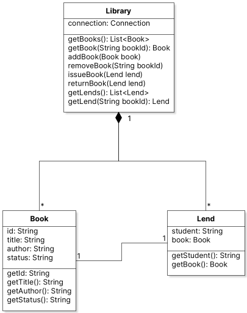

##### View

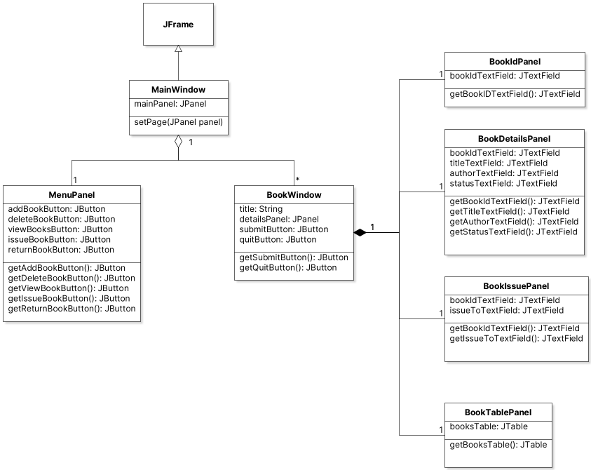

##### Controller

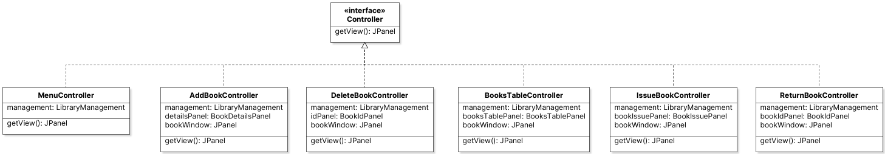

#### Use Case Diagram

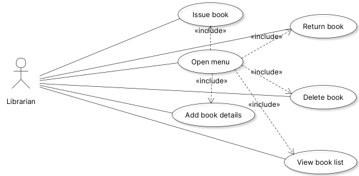

#### Sequence Diagram

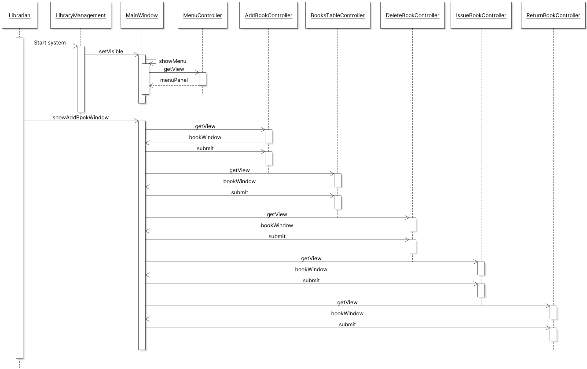

### Database

The model part of the application's MVC structure closely resembles the database tables and their entities.

Whereas the class diagram of the model part includes the `Library` class the database would simply need the attributes from the `Book` and `Lend` classes  as its row values.

As a result, the database entity relationship diagram looks like this:

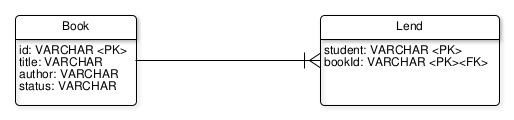

Where: `<PK>` denotes the primary key and `<FK> ` denotes foreign key.

Accessing and creating the MS Access database used in this application was done using the [UCanAccess](http://ucanaccess.sourceforge.net/site.html) library.

Yet, when the application is run for the first time, the MS Access database file will not exist.

Thus, in the code, the I created a class named `MsAccessDatasource` which checks if a MS Access database file exists before creating a JDBC `Connection.` It does this using this code:

```java
private Connection createConnection() {
    try {
        File dbFile = this.getDatabaseFile();
        Connection conn = DriverManager.getConnection(
            "jdbc:ucanaccess://" + dbFile + ";newdatabaseversion=V2010"
        );

        this.createTablesIfNotExist(conn);

        return conn;
    } catch (SQLException ex) {
        System.out.println(SQLExceptionUtil.unwrap(ex));
        throw new RuntimeException(ex);
    }
}
```

The `createTablesIfNotExist` method reads as:

```java
private void createTablesIfNotExist(Connection conn) throws SQLException {
    String createBooksTableSql = ""
            + "CREATE TABLE books ( "
            + "  id VARCHAR(10) NOT NULL, "
            + "  title VARCHAR(20) NOT NULL, "
            + "  author VARCHAR(20) NOT NULL, "
            + "  status VARCHAR(10) NOT NULL, "
            + "  PRIMARY KEY (id) "
            + ");";
    String createLendsTableSql = ""
            + "CREATE TABLE lends ( "
            + "  student VARCHAR (20) NOT NULL, "
            + "  bookId VARCHAR (10) NOT NULL, "
            + "  PRIMARY KEY (student, bookId), "
            + "  CONSTRAINT fk_book FOREIGN KEY (bookId)"
        	+ "  REFERENCES books(id) "
            + ");";

    try ( Statement s = conn.createStatement()) {
        conn.setAutoCommit(false);

        s.addBatch(createBooksTableSql);
        s.addBatch(createLendsTableSql);

        s.executeBatch();
        conn.commit();
    } catch (UcanaccessSQLException ex) {
        if (ex.getMessage().indexOf("object name already exists:") > 0) {
            System.out.println("INFO: Table already exists.");
        } else {
            throw ex;
        }
    } finally {
        conn.setAutoCommit(true);
    }
}
```

When that piece runs for the first time, an MS Access database file is created which features this structure:

##### `books` Table

| id   | title | author | status |
| ---- | ----- | ------ | ------ |
|      |       |        |        |
|      |       |        |        |

##### `lends` Table

| student | bookId |
| ------- | ------ |
|         |        |
|         |        |

With the tables in place, the `Library` class in the `model` package acts as the Data Access Object (DAO) for these tables.

For example, when querying the database for a `List` of all the `Book` objects that can be extracted from it, the `Library` class contains the method `getBooks` which reads as:

```java
public List<Book> getBooks() {
    List<Book> result = new ArrayList<>();

    try ( Statement stmt = connection.createStatement();
         ResultSet rs = stmt.executeQuery("SELECT * FROM books");) {
        while (rs.next()) {
            String id = rs.getString(1);
            String title = rs.getString(2);
            String author = rs.getString(3);
            String status = rs.getString(4);

            result.add(new Book(id, title, author, status));
        }
    } catch (SQLException ex) {
        System.out.println(SQLExceptionUtil.unwrap(ex));
    }

    return Collections.unmodifiableList(result);
}
```

The `getBooks` method, for instance, displays the use of SQL in accessing the database.

As an example, the statement `SELECT * FROM books` causes the database driver to select all the rows from the `books` table and wrap them in a `ResultSet`.

Similarly, when a user instructs the application to add a new `Book` to database, the `Library` class uses its `addBook` method to execute SQL routines as follows:

```java
public void addBook(Book book) {
    try ( PreparedStatement ps = connection.prepareStatement(
        "INSERT INTO books (id, title, author, status)"
        + " VALUES (?, ?, ?, ?)")
        ) {
        ps.setString(1, book.getId());
        ps.setString(2, book.getTitle());
        ps.setString(3, book.getAuthor());
        ps.setString(4, book.getStatus());

        ps.executeUpdate();
    } catch (SQLException ex) {
        System.out.println(SQLExceptionUtil.unwrap(ex));
    }
}
```

### User Interface

The application contains a total of six screens. The first screen that a user encounters on starting the application is the main page which contains a menu. From that screnn, the user can select various actions that are all meant to manage a library's assets.

#### Main Page

The main page contains five buttons and label that displays a welcome message as well as the name of the library being managed.

The five buttons include:

- Add Book Details
- Delete Book
- View Book List
- Issue Book to Student
- Return Book

See screenshot below:

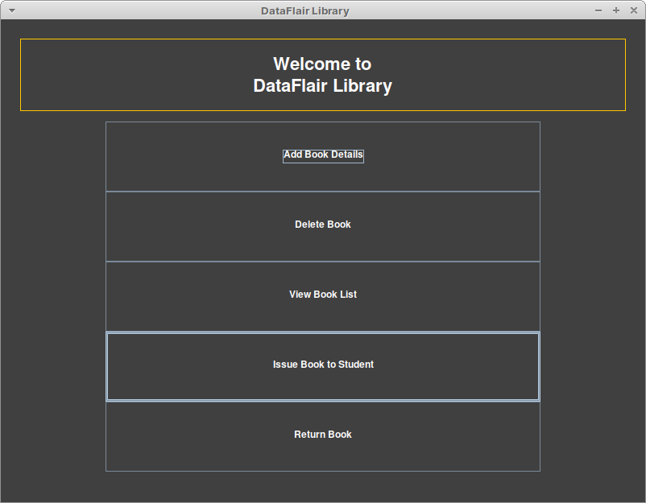

#### Add Book Page

This screen allows the librarian to add the details of a new `Book` to the `Library`.

It presents the user with four text fields which correspond to the `Book` attributes the application captures.

Thus, the user is supposed to use this screen to capture:

- A unique `Book` id
- `Book` title
- `Book` author
- `Book` lending status—that is, whether the book is available or it has been issued to a student

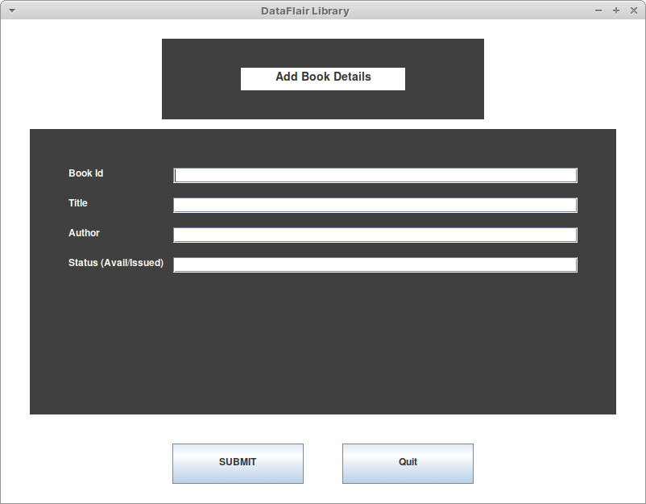

#### Delete Book Page

This screen facilitates the user to remove a `Book` object from the application's database.

With this action, the librarian is supposed to mean that the actual book asset in the library has been decommissioned, lost, or simply no longer available in the library's catalog.

This screen demands only one attribute from the user: the `Book` id. With this, the application will be able to use the `Library` class to purge a row from the `books` database with a matching `id` attribute value.


#### View Book List Page

This screen simply lists all the rows from the `books` and the `lends` tables from the MS Access database file.

The major difference between this screen and the others is that while the `Submit` button causes the application to execute a particular action on the database file, this one simply takes the user back to the Main Page without modifying the database.

In fact the only interaction that occurs when this screen is shown is the querying of the row values from the database tables.

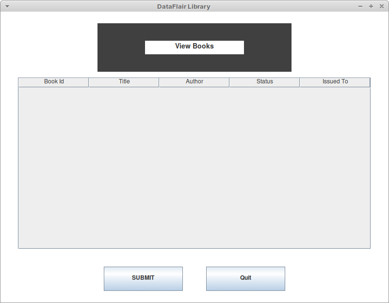

#### Issue Book to Student Page

A librarian will use this screen to enter the id value of a `Book` and the name of a student who wishes to borrow that book.

When these details are provided and the `Submit` button is pressed, the application marks the `Book` object with a matching `id` value as `issued` and then it adds a new row to the `lends` table with these values.

Thus, any data entered into this screen has the potential to affect all the tables in the MS Access database file.

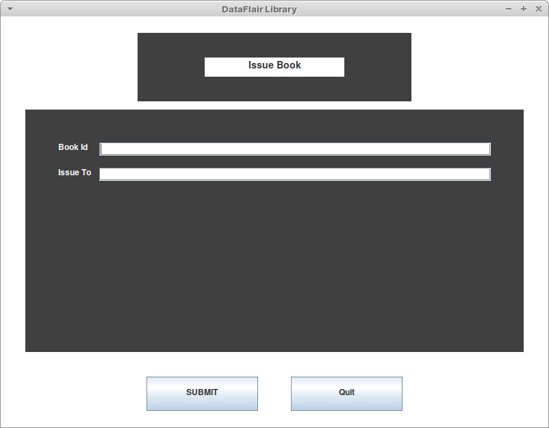

#### Return Book Page

This screen simply captures the id of a `Book` object that was issued to a student earlier.

However, on pressing `Submit` the application first checks the database to see whether the book row with a matching `id` attribute has its `status` attribute marked as `issued`

If its not, that can only mean that the book in question had not been issued out in the first place and thus there's no need to mark it as `avail` again.

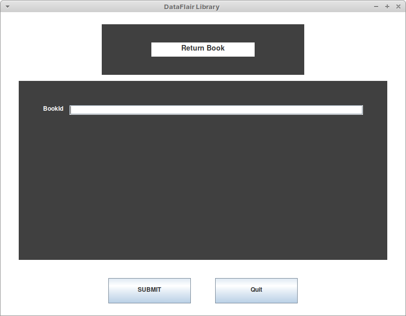

### Implementation

Using the UML diagrams that I had discussed earlier, I created the code using the NetBeans IDE.

And as a result, I created an application named `library-management-system` with a structure that looks as:

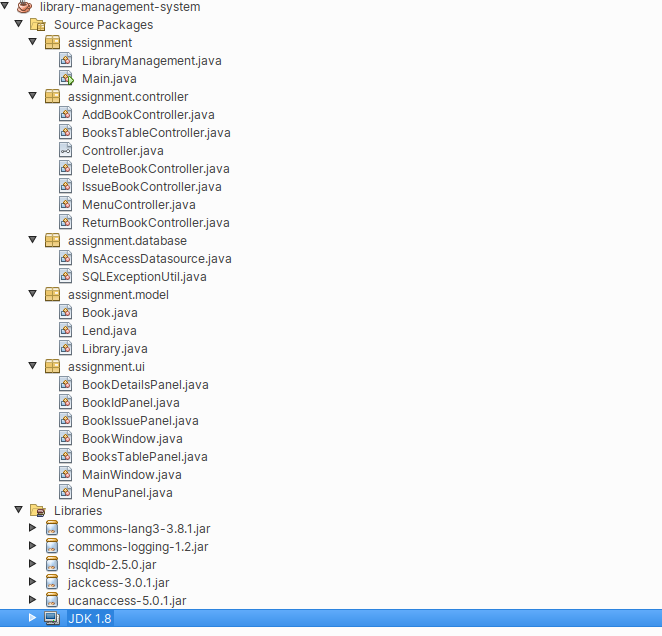

The project contained a total of five packages:

- `assignment`
- `assignment.controller`
- `assignment.database`
- `assignment.model`
- `assignment.ui`

The `assignment` package contains the classes `Main` and `Library`. The `Main` class is the starting point of the application because it contains the main Java method:

```java
package assignment;

public class Main {

    public static void main(String[] args) {
        new LibraryManagement().showMainWindow();
    }
}
```

It simply calls the application's `Library` class which controls most the interactions between the code components.

For instance, the `Library` class provides accessors to the actions that can be used to navigate the application screens:

```java
public void showMenu() {
    ((MainWindow) mainWindow).setPage(menuController.getView());
}

public ActionListener getShowAddBookWindowAction() {
    return showAddBookWindowAction;
}

public ActionListener getShowDeleteBookWindowAction() {
    return showDeleteBookWindowAction;
}

public ActionListener getShowViewBooksWindowAction() {
    return showViewBooksWindowAction;
}

public ActionListener getShowIssueBookWindowAction() {
    return showIssueBookWindowAction;
}

public ActionListener getShowReturnBookWindowAction() {
    return showReturnBookWindowAction;
}

public ActionListener getQuitAction() {
    return quitAction;
}
```

The `assignment.ui` package contained the views which the application displays to the user. These view classes extend the `JFrame` and `JPanel` classes. In addition, they use a combination of `BorderLayout` and `GroupLayout` to organize their internal components.

An excellent example of this is the `BooksTablePanel` which features a `JPanel` that contains a `JScrollPane` and a `JTable`:

```java
public class BooksTablePanel extends JPanel {

    private JTable booksTable;

    public BooksTablePanel() {
        super(new BorderLayout());

        this.initComponents();
    }

    public JTable getBooksTable() {
        return booksTable;
    }

    private void initComponents() {
        DefaultTableModel model = new Model();

        model.addColumn("Book Id");
        model.addColumn("Title");
        model.addColumn("Author");
        model.addColumn("Status");
        model.addColumn("Issued To");

        booksTable = new JTable(model);

        booksTable.setForeground(Color.WHITE);
        booksTable.setBackground(Color.DARK_GRAY);

        add(new JScrollPane(booksTable), BorderLayout.CENTER);
    }

    private class Model extends DefaultTableModel {

        private final boolean[] canEdit = new boolean[]{false, false, false, false, false};

        @Override
        public boolean isCellEditable(int row, int column) {
            return canEdit[column];
        }

    }

}
```

### Execution Details

I used the NetBeans IDE to compile and create an executable jar file for the application.

On compiling the code, the IDE generates folders which are organized as:

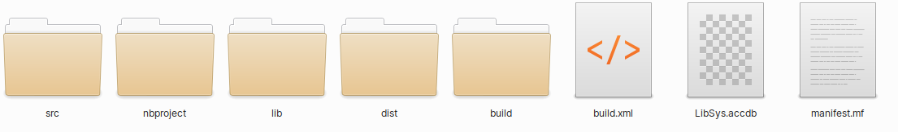


The `LibSys.accdb` is the application's MS Access database file. The `MsAccessDatasource` class in the `assignment.database` package creates this file in the directory path determined using the code:

```java
new File((System.getProperty("user.dir") + File.separator + "LibSys.accdb"));
```

Thus, the application is bound to always have its database file in a predictable location.

Furthermore, in the event that this file is deleted, the application always creates a new one in the same location.

Running the application is only a matter of using the files in the `dist` folder and executing the following command from a terminal:

```shell
$ java -jar library-management-system.jar 
```

This shows how portable the application is—distributing it to other users, for instance, is a matter of sharing the `dist` folder which contains the executable jar file named `library-management-system.jar ` and the dependencies contained in the `lib` folder of the `dist` directory.
